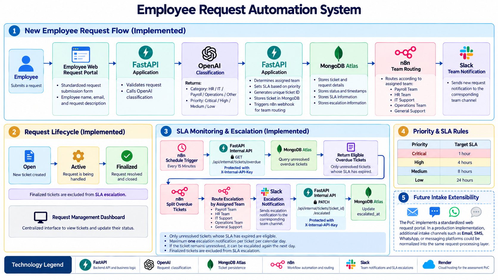

# Employee Request Automation System

An AI-powered employee request management and automation system that classifies employee requests, determines priority, routes requests to the appropriate team, tracks SLA deadlines, and automatically escalates overdue requests through Slack.

The project demonstrates an end-to-end business automation workflow using **FastAPI, OpenAI, MongoDB Atlas, n8n, Slack, and Render**.

---

## Features

- Employee self-service request portal
- AI-powered request classification
- Automatic priority determination
- Automatic team assignment
- Dynamic SLA calculation
- Unique request/ticket IDs
- MongoDB Atlas persistence
- Centralized request management dashboard
- Request status management
- Team-specific Slack notifications
- Automated SLA monitoring every 15 minutes
- Daily escalation reminders for unresolved overdue requests
- Secured internal automation APIs
- n8n-based workflow orchestration
- Public cloud deployment

---

## System Architecture



The system consists of two primary workflows:

1. **New Request Processing** — handles request submission, AI classification, ticket creation, team routing, and Slack notification.
2. **SLA Monitoring & Escalation** — periodically identifies overdue tickets and sends controlled escalation notifications.

---

## Tech Stack

| Area | Technology |
|---|---|
| Backend | Python, FastAPI |
| Frontend | HTML, CSS, JavaScript, Jinja2 |
| AI | OpenAI API |
| Database | MongoDB Atlas |
| Workflow Automation | n8n |
| Notifications | Slack |
| Deployment | Render |
| API Server | Uvicorn |

---

## How It Works

### 1. Employee Request Submission

An employee submits a request through the web portal.

The request contains:

- Employee name
- Employee email
- Request description

FastAPI validates the submission and passes the request text to the AI classification service.

---

### 2. AI Classification

The OpenAI-powered classification layer analyzes the request and determines:

- **Category**
- **Priority**

Supported categories include:

- HR
- IT
- Payroll
- Operations
- Other

Based on the classification result, application rules determine the appropriate support team and target SLA.

---

### 3. Ticket Creation

Every request receives a unique ticket identifier.

Example:

```text
REQ-2026-1DBCAB
```

The ticket is persisted in MongoDB Atlas with information such as:

```text
ticket_id
employee_name
employee_email
request_text
category
priority
assigned_team
status
sla_hours
sla_due_at
created_at
updated_at
resolved_at
is_escalated
escalated_at
```

After creation, the application triggers the n8n request-routing workflow.

---

## Request Lifecycle

Requests progress through the following lifecycle:

```text
Open
  |
  v
Active
  |
  v
Finalized
```

The Request Management Dashboard provides a centralized interface for viewing and managing tickets.

When a request is finalized, its resolution timestamp is recorded. Finalized requests are excluded from future SLA escalation processing.

---

## Request Management Dashboard

The dashboard provides centralized visibility into employee requests and their current state.

Support or administrative users can:

- View submitted requests
- Inspect individual ticket details
- See category and priority
- View the assigned team
- Monitor SLA deadlines
- Identify overdue requests
- Update request status
- Finalize resolved requests

For this Proof of Concept, the dashboard acts as the shared request-management interface. A production implementation could introduce authentication and role-based team views.

---

# Automation Workflows

The system contains two primary n8n workflows.

## Workflow 1 — New Request Routing

After FastAPI creates and stores a ticket, it sends the ticket data to an n8n webhook.

```text
Employee Request
       |
       v
FastAPI
       |
       v
AI Classification
       |
       v
MongoDB Atlas
       |
       v
n8n Webhook
       |
       v
Route by Assigned Team
       |
       +----> Payroll
       |
       +----> HR
       |
       +----> IT
       |
       +----> Operations
       |
       +----> General Support
                    |
                    v
                  Slack
```

n8n evaluates the assigned team and routes the request notification to the corresponding Slack channel.

This provides immediate visibility to the team responsible for handling the request.

---

## Workflow 2 — SLA Monitoring & Daily Escalation

A second n8n workflow runs every **15 minutes** to identify unresolved tickets that have exceeded their SLA.

```text
Check SLA Every 15 Minutes
           |
           v
Get Overdue Tickets
           |
           v
Split Overdue Tickets
           |
           v
Route Escalation by Assigned Team
           |
     +-----+-----+-----+------------+
     |     |     |     |            |
 Payroll   HR    IT  Operations   General
     |     |     |     |            |
     +-----+-----+-----+------------+
                       |
                       v
                 Slack Escalation
                       |
                       v
              Mark Ticket Escalated
```

The workflow communicates with secured FastAPI internal endpoints to retrieve eligible overdue tickets and record successful escalations.

### Daily Escalation Logic

An unresolved overdue ticket receives a maximum of **one escalation notification per calendar day**.

```text
Ticket exceeds SLA
        |
        v
Slack escalation sent
        |
        v
escalated_at updated
        |
        v
Further checks on the same day
        |
        v
Ticket skipped
        |
        v
Next calendar day
        |
        v
Still overdue and unresolved?
        |
       Yes
        |
        v
Send another escalation
```

This prevents repeated notifications every 15 minutes while ensuring unresolved SLA breaches continue to receive attention.

Daily escalation boundaries are evaluated using the **Asia/Kolkata** timezone.

---

## Internal Automation API

The SLA workflow communicates with dedicated FastAPI endpoints:

```text
GET   /api/internal/tickets/overdue
PATCH /api/internal/tickets/{ticket_id}/escalated
```

These endpoints require an internal API key supplied through:

```text
X-Internal-API-Key
```

The key is stored securely as an environment variable and is never committed to source control.

---

## Project Structure

```text
employee-request-system/
|
+-- app/
|   +-- config/
|   |   +-- settings.py
|   |   +-- templates.py
|   |
|   +-- database/
|   |   +-- mongodb.py
|   |
|   +-- models/
|   |   +-- ticket.py
|   |
|   +-- routes/
|   |   +-- admin.py
|   |   +-- internal.py
|   |   +-- tickets.py
|   |   +-- web.py
|   |
|   +-- schemas/
|   |   +-- ticket.py
|   |
|   +-- services/
|   |   +-- automation_service.py
|   |   +-- classification_service.py
|   |   +-- ticket_service.py
|   |
|   +-- static/
|   |   +-- css/
|   |   +-- js/
|   |
|   +-- templates/
|   |   +-- base.html
|   |   +-- dashboard.html
|   |   +-- request_form.html
|   |   +-- request_success.html
|   |   +-- ticket_detail.html
|   |
|   +-- main.py
|
+-- docs/
|   +-- architecture-diagram.png
|
+-- n8n/
+-- tests/
+-- .env.example
+-- .gitignore
+-- README.md
+-- requirements.txt
```

---

# Local Setup

## 1. Clone the Repository

```bash
git clone https://github.com/saiffOP/employee-request-automation-system.git
cd employee-request-automation-system
```

## 2. Create a Virtual Environment

```bash
python -m venv .venv
```

### Windows

```bash
.venv\Scripts\activate
```

### macOS / Linux

```bash
source .venv/bin/activate
```

## 3. Install Dependencies

```bash
pip install -r requirements.txt
```

## 4. Configure Environment Variables

Copy:

```text
.env.example
```

to:

```text
.env
```

Configure the required environment variables:

```text
MONGODB_URI
MONGODB_DATABASE
OPENAI_API_KEY
OPENAI_CLASSIFICATION_MODEL
N8N_NEW_REQUEST_WEBHOOK_URL
INTERNAL_API_KEY
```

Never commit the `.env` file.

## 5. Start FastAPI

```bash
uvicorn app.main:app --reload
```

The local application will be available at:

```text
http://127.0.0.1:8000
```

Request Management Dashboard:

```text
http://127.0.0.1:8000/admin
```

---

## Deployment

The assessment prototype is deployed on **Render**.

Production environment variables are configured through the hosting environment rather than stored in the repository.

The deployed FastAPI application communicates with:

```text
Render
   |
   +--> MongoDB Atlas
   |
   +--> OpenAI API
   |
   +--> n8n Cloud
            |
            +--> Slack
```

This allows the assessment prototype to operate independently of the developer's local machine.

---

## n8n Workflows

Sanitized workflow exports are stored in:

```text
n8n/
```

The repository contains workflows for:

1. New employee request routing
2. SLA monitoring and daily escalation

The exported versions contain no production API keys or Slack credentials. Anyone importing the workflows must configure their own credentials and deployment endpoints.

---

## Security

The project applies several security practices appropriate for the Proof of Concept:

- Secrets are stored using environment variables.
- `.env` is excluded from Git.
- MongoDB credentials are not stored in source code.
- OpenAI credentials are not stored in source code.
- Internal automation endpoints require API-key authentication.
- Public n8n workflow exports are sanitized.
- Production credentials are configured separately in Render and n8n.

The publicly hosted assessment environment contains only demonstration data and is intended as a temporary Proof of Concept.

---

## Future Improvements

For a production implementation, the system could be extended with:

- Authentication and Single Sign-On (SSO)
- Role-based access control
- Team-specific request dashboards
- Employee self-service ticket tracking
- Complete ticket audit history
- SLA analytics and reporting
- Queue-based asynchronous processing
- Centralized logging
- Monitoring and observability
- Automated integration and end-to-end tests
- CI/CD pipelines
- Managed secret storage
- High-availability cloud infrastructure

---

## Author

**Mohammed Saif Shirgaonkar**

AI / Machine Learning Engineer